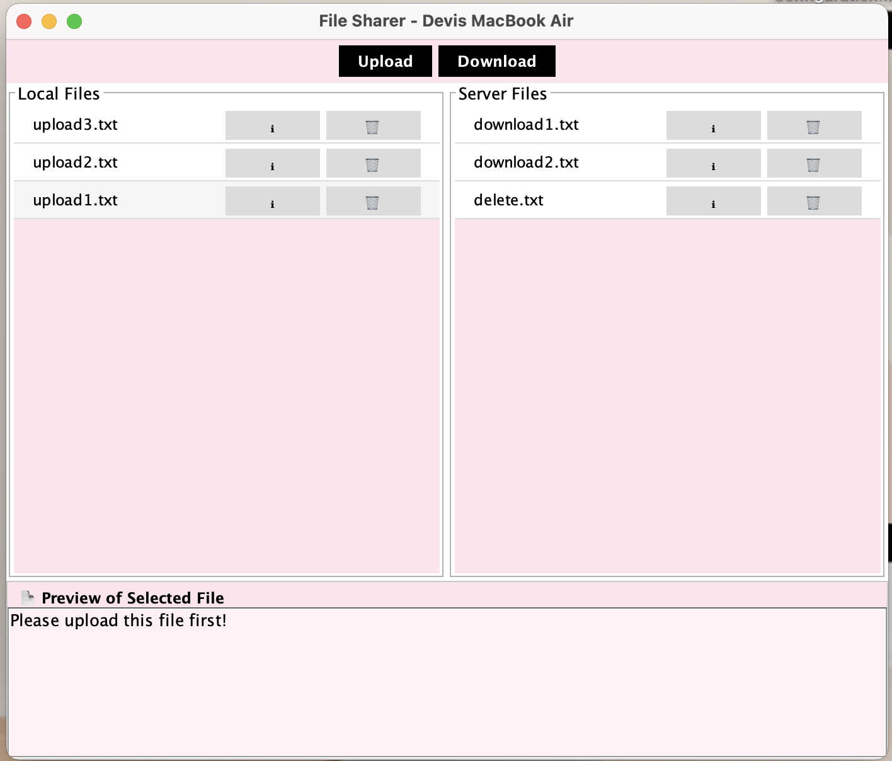
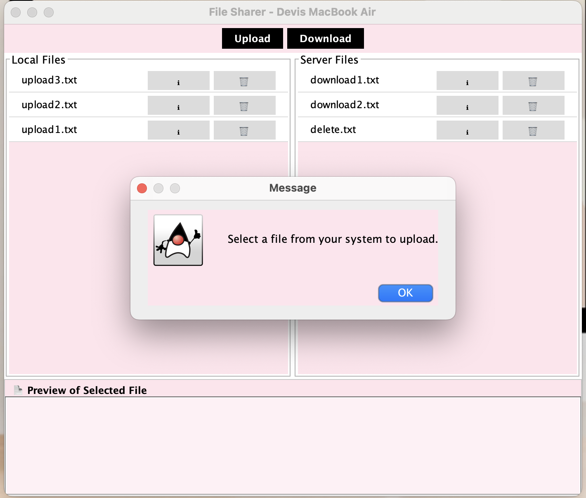
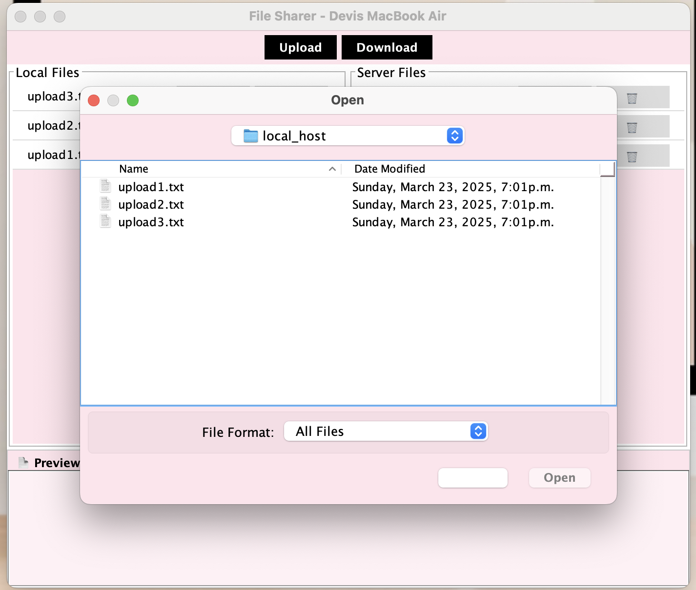
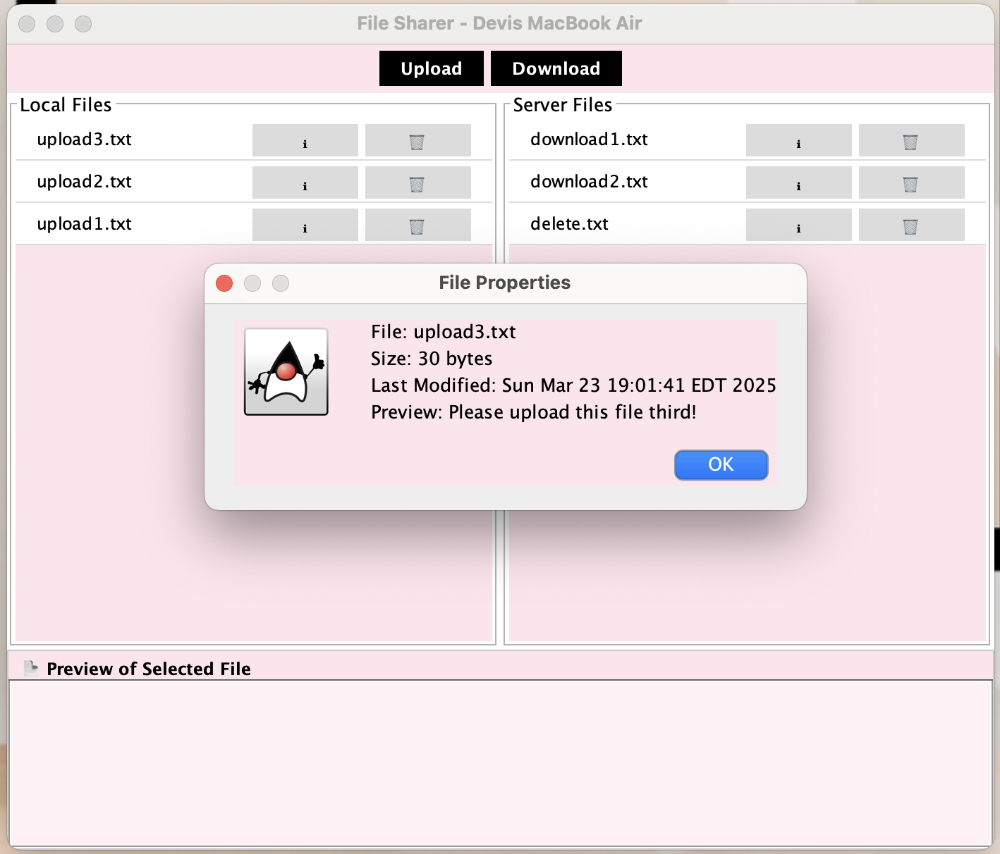

File Sharing System
CSCI 2020U: System Development and Integration

## Description

We developed a client-server-based file-sharing system. The application 
enables users to interact with a shared file repository through a client-server architecture.

The key functionalities of the application include:

1. Uploading Local Files: Users can upload files from their local machine to a centralized shared folder, allowing multiple users to access and retrieve these files.

2. Downloading Files: Users can also download files from the shared folder to their local storage, enabling them to access files uploaded by others in a collaborative environment.

The system is designed to support multiple users simultaneously, with the server acting as the central hub for file 
storage and the clients communicating with it to upload, download, and list available files. This setup ensures that
users can easily share files with one another, contributing to a collaborative work environment.

## Running Application 

    

    

    

    

## UI Enhancements 

To increase the readability, make our application more user-friendly, and add some aesthetics our group decided to add 
the following features: 

1. Added the name of the client computer to the title of the window.
2. Users are able to upload files from the local device
3. Users can see the contents of the file in a "Preview" section at the bottom of the window
4. Custom icons/buttons beside each file:
   - 🗑: Deletes the file from that folder
   - ℹ : Gives the user details about the properties of the file including the size of the file, name of the file, and a timestamp of when the file was last updated

## How to Run The Application 

To successfully clone and run the application here are the steps the user must take:

1. Ensure that the computer in which the application will be running on has the following installed: Java, Git, and an IDE (preferably IntelliJ)
2. Go onto the GitHub repository and copy its URL [Link to Repository](https://github.com/OntarioTech-CS-program/w25-csci2020u-assignment02-a2-soni-soni-dsouza.git)
3. Open up the terminal and clone the repository using the following git command: **git clone**
4. Open the project in the IDE of your choice (may have to import as a Maven Project)
5. Navigate to the files called **FileServer.java** (src/main/java/server) and **FileClientGUI.java** (src/main/java/server)
6. Before you can run any of the files please watch this short video on how to edit your configurations [Link to Video](https://drive.google.com/file/d/1UP2cc2wMwjjAMbErrP6CbnDOM_zJbmNu/view?usp=sharing)
6. Once you have set up the configurations correctly please run the **FileServer.java** file first and then the **FileClientGUI.java** file.
7. Give the application a couple seconds to run and then the output should be displayed!

**Side Note**: When testing the code please upload the following files: "upload1.txt", "upload2.txt", and "upload3.txt", 
download the following files "download1.txt", and "download2.txt" and delete the "delete.txt" file.
